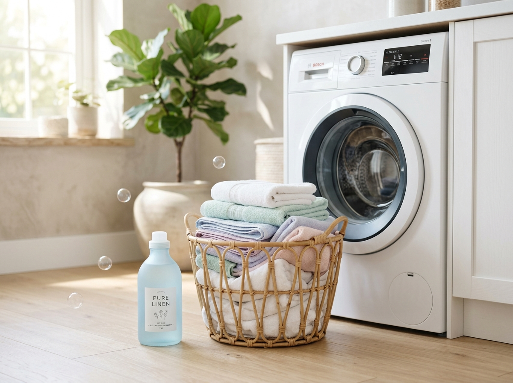

# Dhobiclean 🧺✨

A modern, responsive, and picture-perfect landing page for **Dhobiclean** — an on-demand laundry and dry cleaning care service.



## 🌟 Features

- **Hero Section**: Modern typography, call-to-action buttons, and laundry imagery with floating bubble micro-animations.
- **Metrics Bar**: Key trust indicators (Happy Customers, Machines, Customer Satisfaction, 24/7 Support).
- **Interactive Pickup Booking Card**:
  - Customer details input (Name, Phone, Address).
  - Flexible pickup day & time slot picker.
  - Interactive service selection with dynamic quantity steppers `[-] / [+]`:
    - Wash & Iron
    - Dry Cleaning
    - Wash & Fold
    - Shoe Cleaning
    - Steam Iron
    - Curtains & Bedding
  - Store branch selector.
  - Live cart summary calculation & booking confirmation modal.
- **Why Choose Dhobiclean**: 4 key value propositions with custom icons and soft ambient lighting.
- **Premium Footer**: Quick links, services directory, 24/7 contact support, discount newsletter signup, and legal links.

## 🚀 Getting Started

Simply open `index.html` in any modern web browser or run a lightweight local static server:

```bash
# Python
python -m http.server 8080

# Or Node.js
npx serve .
```

Open [http://localhost:8080](http://localhost:8080) in your browser.

## 🛠️ Built With

- **HTML5** (Semantic structure)
- **Vanilla CSS3** (Custom properties, grid, flexbox, glassmorphism, keyframe animations)
- **JavaScript (ES6+)** (Interactive state management, pricing calculator, modal controller)
- **Google Fonts** (Plus Jakarta Sans)
